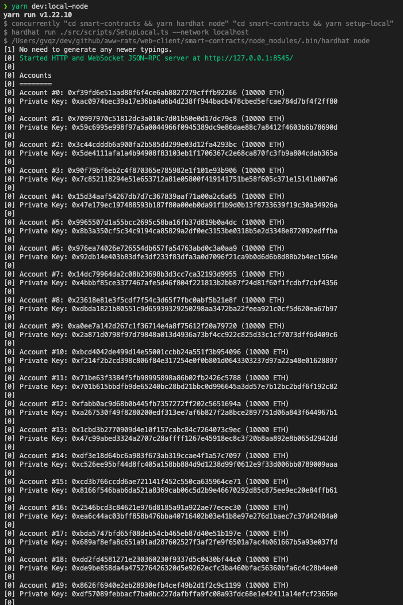

# Gitcoin: Integrating “Login with Unstoppable” as a Dapp login option

Project Name: Aww, Rats!

[PR to a public repo](https://github.com/ClickPop/aww-rats-client/pull/147)

Recorded video demo of integration: N/A (couldn't get it to work)

Person of contact in case there are any questions:

  * discord ID: brighttux#0661
  * UnstoppableDomain registered account email address: clarence_han@hotmail.com

# Aww, Rats! web-client and smart-contract mono repo

This is a mono repo housing both the web-client and smart-contracts used by Aww, Rats!

## Setting up the project

### Prerequisites

- [Node](https://nodejs.org/en/)
- [Yarn](https://yarnpkg.com/)
- Env variables (Lmk if you need these, but they should be in the Google Cloud secrets manager)

### Installation

1. Run `yarn install-all` to install the deps for both parts of the repo.
2. Make sure you have a file called `.env.local` with the required env vars. Again, these should be in Google Cloud Secrets Manager.
4. Run `yarn dev` to start the development server (This will also run the Solidity compiler in watch mode).
5. Navigate your browser to http://localhost:3000.

### Running the entire flow locally

If you want to do all of the development locally you can run a local blockchain either from within `hardhat` (The framework we use for writing, testing, and managing the smart-contracts) or via [ganache](https://www.trufflesuite.com/ganache). You can also run the the [generator](https://github.com/ClickPop/aww-rats-generator) locally. Follow the README there for instructions on setting that up. Once you have it setup, make sure to set the `GENERATOR_URL` to `http://localhost:8080` in `.env.local`

In this case we are going to just worry about running locally with hardhat so there won't be any additional setup.

1. In a separate terminal run `yarn dev:local-node`. This will start a local blockchain, deploy a mock ERC-20 token, supply each account with 10 tokens, and deploy the rat contract.
2. You will get a ton of output, but scroll up and you should see a list of private keys and addresses:
   1. 
3. You will want to take note of one of those private keys (Just not #0 as that is the address that gets used as the admin for the contracts) and [import it into Metamask](https://metamask.zendesk.com/hc/en-us/articles/360015489331-How-to-import-an-Account).
4. Next you will want to take note of the address of the deployed `Rat ERC-721` contract:
   1. 
5. Take that address and add it to the as the `NEXT_PUBLIC_CONTRACT_ADDRESS` in your `.env.local`.
6. You will also need to add the local development chain to Metamask:
   1. 

That should be it to get setup locally. Again, be sure to follow the directions in the generator repo's `README` to be sure that is setup correctly.
