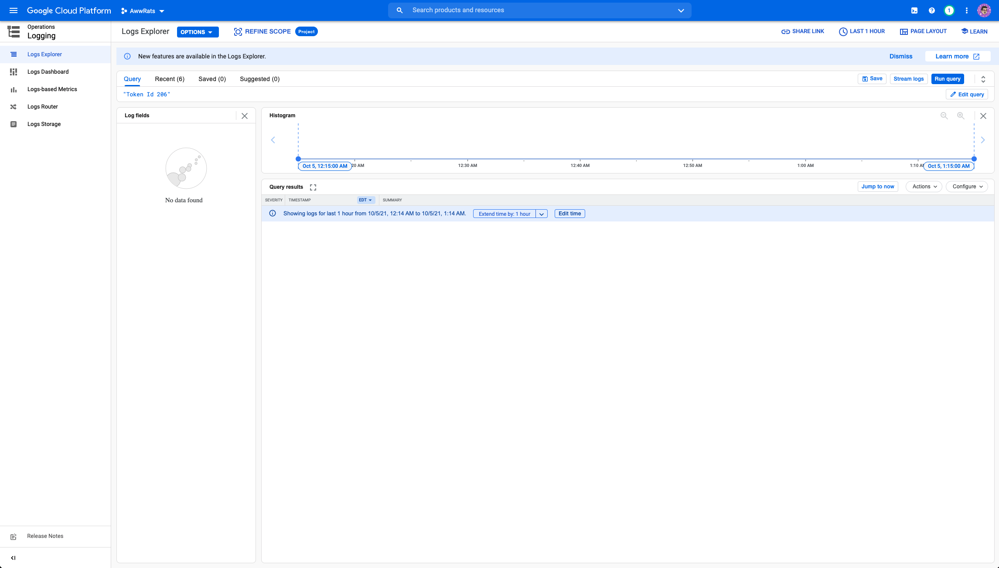

# Aww, Rats! smart contracts

## Setting up the project

### Prerequisites

- [Node](https://nodejs.org/en/)
- [Yarn](https://yarnpkg.com/)
- Env variables (Lmk if you need these, but they should be in the Google Cloud secrets manager)

### Setup

1. Run `yarn` to install all deps
2. Run `yarn hardhat` to see a list of all the prewritten tasks we have in the `hardhat.config.ts` file.
   1. If you have any questions, just ask Graham

## Helpful scripts

Sometimes we want to make changes or check on some stuff with our contract. I wrote a couple scripts (Hardhat calls them "tasks") that make managing it a breeze.

Just run `yarn hardhat` to see a list of all the available tasks and flags. The couple to note are:
- `list-limbo-rats`
  - This lists all token ids that currently don't have an IPFS URI set.
  - Take this with a grain of salt, as some of those might still have pending transactions. 
  - The easiest way to check that is by heading to the [logs](https://console.cloud.google.com/logs/query;query=%22Token%20Id%20206%22?project=awwrats). You'll be met with a screenshot like:
    - 
    - Just replace the 206 with the token ID you want to check and click the **run query** button. If you don't see any, click the **extend by 1 hour** button to extend the window that you're looking at, or you can select a larger extension from the drop down. If you know the specific time/date range, you can also specify it with the **edit time** button.
    - If you see any results, click on them to expand. Then find the `TxHash` and copy it into [polygonscan](https://polygonscan.com/).
    - Check if any of the transactions are pending. If they are, you've just gotts sit tight, until they all either succeed or error out. 
      - Sometimes they will just dissapear. If that happens just hang tight for a bit longer. If it doesn't come back for like 2 or 3 hours, then you might want to consider regenerating the rat.
- `regenerate-rat`
  - This allows you to regenerate a rat. It takes one required arg, the token Id.
  - It will hit our `generate-rat` endpoint and print the results to the console. Take note of the transaction hash and follow the steps from the previous command for checking the has on polygonscan.

Another thing to note is that you need to specify the correct network to run the task on. Generally this will always be `polygon` unless you're working on the testnet, then you would use `polygonTest`. An example of this would be:

`yarn hardhat list-limbo-rats --network polygon`

This would check all the tokens on the polygon mainnet and return any that have the default tokenURI set.